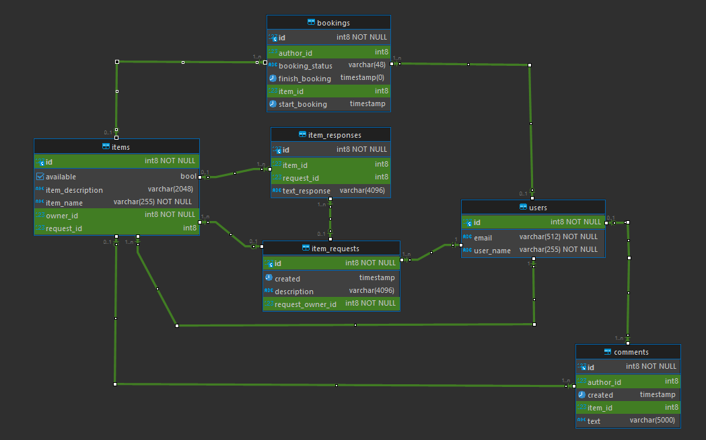

# java-shareit

## _The repository of the app for renting things in which users can:_
- Share things;
- book them;
- leave comments;
- make requests for things that require;

*__Endpoints:__*
* create user: ``` ```
* update user: ``` ```


*__Database ERDiagram__* 
